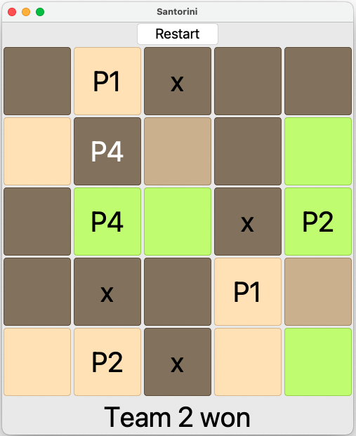

# Board game Santorini with reinforcement learning algorithms
This project applies Reinforcement algorithms to the board game Santorini without Godly powers.
The training uses PPO, A2C, and TRPO algorithms with the self-play technique and optional random or minimax agents.
Graphical User Interface and multi-player mode are available.

## Install with python 3.10

```bash
pip install -r requirements.txt
```

## Play
### Play with a random agent:

```bash
python play.py -p2 random
```


### Play with a minimax agent:

```bash
python play.py -p2 minimax1 # depth 1
python play.py -p2 minimax2 # depth 2
python play.py -p2 minimax3 # depth 3
```

### Play with a trained model: 
```bash
python play.py -p2 rl -bm init-rand
```

### Play with another person:
```bash
python play.py -p2 human
```

### Watch agents playing:
```bash
# 2 players mode: 1 vs 1
python play.py -p1 rl -p2 minimax3
# 3 players mode: 1 vs 1 vs 1
python play.py -p1 minimax3 -p2 minimax3 -p3 minimax3
# 4 players mode: 2 vs 2
python play.py -p1 minimax3 -p2 minimax3 -p3 minimax3 -p4 minimax3
```


### User Interface:
<p align="center">
  
</p>

## References

### Santorini
- Game Rules: http://files.roxley.com/Santorini-Rulebook-Web-2016.08.14.pdf

### Reinforcement Learning

- self-play: https://en.wikipedia.org/wiki/Self-play_(reinforcement_learning_technique)

- A2C and PPO algorithms: https://stable-baselines3.readthedocs.io/en/master/

- TRPO algorithm: https://sb3-contrib.readthedocs.io/en/master/